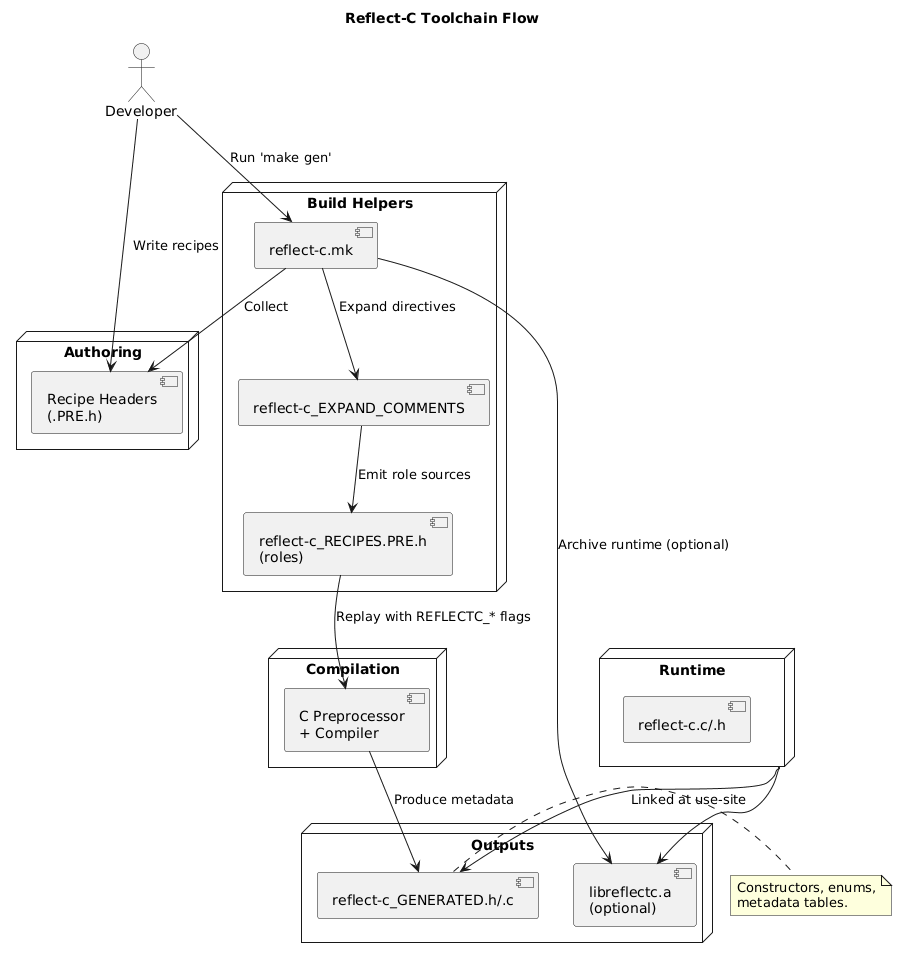

# Reflect-C

Reflection-friendly data describes complex C types without hand-written metadata. **Reflect-C** generates that metadata for you at compile time, so you can explore, serialize, or mutate structs, unions, and enums from generic code while staying within portable ANSI C.

## Highlights

- **Zero-cost metadata** - generation happens at build time, no runtime parsing.
- **Struct/union/enum coverage** - handles nesting, pointers, arrays, and qualifiers.
- **Runtime helpers** - walk members, compute pointer depth, copy values, or allocate arrays through a uniform API.
- **Battle-tested** - JSON round-trip examples and unit tests validate the generated metadata.
- **Self-contained** - depends only on the standard library and your recipes.

## How the toolchain works



Reflect-C relies on *recipes*—header fragments that describe your types using a macro DSL. The build system performs four stages:

1. **Collect recipes** - you list your `.PRE.h` recipe files (defaults live under `api/`).
2. **Expand directives** - `reflect-c_EXPAND_COMMENTS` converts special `/*#! ... */` directives into active code before preprocessing.
3. **Preprocess with roles** - `reflect-c_RECIPES.PRE.h` pulls in every recipe multiple times with different `REFLECTC_*` flags to emit actual C definitions, lookup tables, and wrapper functions.
4. **Emit amalgamated sources** - the helper makefile `reflect-c.mk` produces `reflect-c_GENERATED.h/.c` alongside an optional static library `libreflectc.a` for the runtime helpers in `reflect-c.c`.

The pipeline is intentionally pure-C, so the same commands work on any system with an ANSI C compiler.

## Quick start

1. **Clone and build the generator tools.**

   ```sh
   git clone https://github.com/lcsmuller/reflect-c.git
   cd reflect-c
   make gen
   ```

   This compiles `reflect-c_EXPAND_COMMENTS`, builds the runtime library, and generates amalgamated sources from the sample recipes under `api/`.

1. **Describe your types in a recipe.** Recipes are thin macro invocations that stay valid headers. Place a file like `api/person.PRE.h` in the repository:

   ```c
   /* person.PRE.h */
   #ifdef REFLECTC_DEFINITIONS
   /*#!
   #include <stdbool.h>
   */
   #endif

   PUBLIC(struct, person, 4, (
       (_, _, char, *, name, _),
       (_, _, int, _, age, _),
       (_, _, bool, _, active, _),
       (_, _, char, *, email, _)
   ))
   ```

   A few macros worth knowing (see [Recipe syntax](#recipe-syntax) for details):

   - `PUBLIC` / `PRIVATE` chooses whether the generated symbols are exported.
   - Tuple columns encode qualifier, container (`struct`, `union`, `enum`), raw type, pointer decoration, member name, and array dimensions.
   - **`/*#! ... */` directives** - **Required** for any `#include` or `#define` statements that the generator needs to see. These directives become active during generation but remain comments in normal compilation units. Without them, the preprocessor never sees your helper includes and generation fails silently.

1. **Regenerate metadata.**

   ```sh
   make gen            # rebuilds reflect-c_GENERATED.c/h from all recipes
   ```

1. **Use the runtime API.**

   ```c
   #include "reflect-c.h"
   #include "reflect-c_GENERATED.h"

   int main(void) {
       struct person alice = {"Alice", 30, true, "alice@example.com"};
       struct reflectc *r = reflectc_from_person(&alice, NULL);

       /* Fast indexed access via generated enums */
       size_t name_pos = reflectc_get_pos_fast(struct, person, name, r);
       const char *name = reflectc_get_member(r, name_pos);

       printf("%s is %d years old\n",
              name,
              *(int *)reflectc_get_member(r, reflectc_get_pos_fast(struct, person, age, r)));

       free(r); /* You own the wrapper memory */
       return 0;
   }
   ```

## Recipe syntax

Recipes live in `.PRE.h` files that can be included safely in regular code. Each entry is a macro of the shape

```c
PUBLIC(container_kind, type_name, member_count, (members...))
```

where `container_kind` is `struct`, `union`, or `enum`. Member tuples differ slightly depending on the container:

| Container | Tuple signature | Example |
| --- | --- | --- |
| `struct` / `union` | `(qualifier, container, type, decorator, name, dimensions)` | `(_, _, char, *, name, [32])` |
| `enum` | `(enumerator, assignment_op, value)` | `(LEVEL_ONE, =, 1)` |

Special columns:

- **Qualifier** - `const`, `volatile`, or `_` for none.
- **Container** - `struct`, `union`, or `_` for plain arithmetic types.
- **Decorator** - pointer depth (`*`, `**`) or `_` for scalars.
- **Dimensions** - array declarators (e.g., `[4]`).

During generation the recipes are replayed under different macros: once to emit actual C definitions, once to create lookup enums, once to build metadata tables, and finally to emit constructor functions (`reflectc_from_<type>`).

For an exhaustive walkthrough see [docs/recipe-format.md](docs/recipe-format.md).

## Runtime API highlights

The runtime layer (`reflect-c.h` / `reflect-c.c`) manages metadata trees produced by the generator.

| Function | Purpose |
| --- | --- |
| `struct reflectc *reflectc_from_<type>(<type> *self, struct reflectc *reuse)` | Materialize metadata for an instance. Pass `NULL` to allocate a fresh tree or reuse an existing buffer for arrays. |
| `size_t reflectc_length(const struct reflectc *member)` | Compute the effective length, expanding array dimensions on demand. |
| `size_t reflectc_get_pos(const struct reflectc *root, const char *name, size_t len)` | Lookup a member by string at runtime. |
| `reflectc_get_pos_fast(struct, type, field, root)` | Generated macro returning a compile-time index for a field. |
| `const void *reflectc_get_member(...)` | Dereference the pointer to a member inside the wrapped object with bounds checking. |
| `const void *reflectc_deref(const struct reflectc *field)` | Resolve multi-level pointers and array declarators to the "natural" pointed-to object. |
| `const void *reflectc_set(...)` / `reflectc_memcpy` | Copy data into a member, with size guards. |
| `const char *reflectc_string(...)` | Copy string data into pointer fields, allocating storage when needed. |
| `void reflectc_array(const struct reflectc *root, size_t length)` | Resize metadata for treated-as-array members (e.g., JSON arrays). |

All wrappers share the same layout defined in `struct reflectc` so tooling can walk types generically.

## Examples

### JSON serialization/deserialization

`test/test.c` demonstrates a full round-trip using [JSON-Build](json-build/) and `jsmn-find`. The reflection metadata drives both the serializer and parser, including pointer depth detection for `NULL` handling. Run it with:

```sh
make -C test
./test/test
```

### Iterating members generically

```c
struct reflectc *wrapper = reflectc_from_baz(&baz, NULL);
for (size_t i = 0; i < wrapper->members.length; ++i) {
    const struct reflectc *field = &wrapper->members.array[i];
    printf("%.*s -> size %zu\n", (int)field->name.length, field->name.buf, field->size);
}
free(wrapper);
```

### Editing nested structures

```c
size_t number_pos = reflectc_get_pos_fast(struct, bar, number, bar_ref);
int new_value = 1337;
reflectc_set_member(bar_ref, number_pos, &new_value, sizeof new_value);
```

### Extending scalar tags

```c
/* hooks.PRE.h */
#ifdef REFLECTC_DEFINITIONS
/*#!
#include <stdbool.h>
#include <stddef.h>
typedef size_t reflectc_words_t;
typedef unsigned long reflectc_numbers_t;
enum reflectc_custom_types {
   REFLECTC_TYPES__reflectc_words_t = REFLECTC_TYPES__EXTEND,
   REFLECTC_TYPES__reflectc_numbers_t,
};
*/
#endif

PUBLIC(struct, hooks, 4, (
   (_, _, int, _, value, _),
   (_, _, bool, _, flag, _),
   (_, _, reflectc_words_t, _, words, _),
   (_, _, reflectc_numbers_t, _, numbers, _)
))
```

At runtime the custom members resolve to the new enum values:

```c
struct hooks sample = {21, true, 512u, 7ul};
struct reflectc *wrapper = reflectc_from_hooks(&sample, NULL);
size_t words_pos = reflectc_get_pos_fast(struct, hooks, words, wrapper);
const struct reflectc *words = &wrapper->members.array[words_pos];

if (words->type == (enum reflectc_types)REFLECTC_TYPES__reflectc_words_t) {
   printf("words: %zu\n", *(reflectc_words_t *)reflectc_get_member(wrapper, words_pos));
}

free(wrapper);
```

These snippets, plus additional walkthroughs, are collected in [docs/examples.md](docs/examples.md).

## Building, testing, and integrating

- **Build metadata and library** - `make gen` (default compiler is `cc`).
- **Debug builds** - `make debug-gen` keeps debug symbols in the generated library and runtime.
- **Clean artifacts** - `make clean` removes generated files, `make purge` also removes the static library.
- **Run unit tests** - `make -C test` builds the test harness, then run `./test/test`.

### Tuple helper generation (optional)

The header `reflect-c_TUPLE.h` contains preprocessor helpers used by the recipe DSL. It is checked in with a default arity, but you can regenerate it to support a larger maximum tuple size when needed.

- Regenerate with a custom maximum (e.g., 64):

   ```sh
      make tuples REFLECTC_TUPLE_MAX=64
   ```

- The generator is a small ANSI C program at `tools/gen_tuples.c`

Commit the regenerated header if you want downstream builds to avoid running the generator.

### Integrating into another project

1. **Vendor the sources (recommended: Git subtree)**

    Use Git subtree to vendor this repository into your project without submodule friction.

    - Add the upstream remote and create the subtree under `third_party/reflect-c`:

       ```sh
       git remote add reflect-c https://github.com/lcsmuller/reflect-c.git
       git subtree add --prefix=third_party/reflect-c reflect-c master --squash
       ```

    - Update later to pull new changes from upstream:

       ```sh
       git fetch reflect-c
       git subtree pull --prefix=third_party/reflect-c reflect-c master --squash
       ```

    Alternatively, you can copy `reflect-c/` into `third_party/reflect-c` (any location works as long as your build can reach the files).
2. **Author your recipes** - place your own `.PRE.h` files (e.g., `recipes/player.PRE.h`) in a directory you control. Use the macro DSL to describe each struct/union/enum, and include supporting headers inside the `/*#! ... */` blocks.
3. **Generate metadata during your build** - invoke the helper makefile with your recipe directory and desired output stem. For example:

   ```sh
   make -C third_party/reflect-c API_DIR=../app/recipes OUT=app_reflect gen
   ```

   This produces `app_reflect.c`, `app_reflect.h`, and `app_reflect.o` alongside the runtime library. For CMake, Meson, or others, wrap that command in a custom build step so it re-runs when recipes change.
4. **Compile and link** - add the generated `.c` (or `.o`) plus `reflect-c.c` to your project, or simply link against the provided `libreflectc.a`. Ensure your compiler’s include path covers both `reflect-c.h` and the generated header.
5. **Use the helpers at runtime** - include the headers, call `reflectc_from_<type>` to wrap your instances, and interact with fields via `reflectc_get_pos_fast`, `reflectc_get_member`, or the other API functions described above. Free wrappers with `free` when done.
6. **Optional polish** - commit generated files if you need deterministic builds without the generator present, or extend the emitted enum range by adding typedefs and enums mapped to `REFLECTC_TYPES__EXTEND` within your recipes.

## Project structure

```text
reflect-c/
├── recipes/                # Core macro recipes that drive generation
├── api/                    # (create this) your application-specific recipes
├── reflect-c.c/.h          # Runtime helpers shared by all generated wrappers
├── reflect-c.mk            # Build helper invoked by `make gen`
├── docs/                   # Supplemental documentation (plan, recipe syntax, examples)
└── test/                   # JSON demo and integration tests using Greatest
```

## Limitations & FAQ

- **Memory ownership** - `reflectc_from_*` allocates wrapper trees with `malloc`. Free them with `free` when done.
- **Bitfields/variadic arrays** - not supported today; stick to plain declarators.
- **Pointer depth heuristics** - `reflectc_deref` dereferences multi-level pointers once for convenience. Override by calling `reflectc_get_member` directly.
- **Custom allocators** - the runtime uses `malloc`/`calloc`/`realloc`. Swap in your own versions before linking if you need arena integration.
- **Compiler support** - tested with ANSI C (C89) compliant compilers. Newer language features (designated initializers, `_Static_assert`) are not assumed.

## Contributing

Bug reports, recipe ideas, and documentation PRs are welcome! Please run `make gen` and `make -C test` before submitting.

## License

Distributed under the MIT License. See `LICENSE` for details.
